# TaskFlow-Intelligence-Automated-Daily-Task-Summarization-System-N8N-
# TaskFlow Intelligence 🚀

> Automated Daily Task Summarization System powered by AI

[](https://n8n.io)
[](https://openai.com)
[](https://supabase.com)
[](https://notion.so)
[](https://gmail.com)

## 📋 Overview

TaskFlow Intelligence transforms raw task data into actionable insights through an intelligent automation pipeline. This n8n workflow automatically retrieves tasks from Supabase, generates AI-powered summaries, documents findings in Notion, and delivers personalized notifications via Gmail.

**Problem Solved:** Eliminates manual task reporting overhead and improves team visibility across scattered productivity platforms.

## ✨ Features

- 🤖 **AI-Powered Summarization** - GPT-4.1-mini generates contextual task reports
- 📊 **Smart Filtering** - Automatically processes only due and overdue tasks  
- 📝 **Centralized Documentation** - Creates structured summaries in Notion
- 📧 **Automated Notifications** - Delivers personalized briefings via Gmail
- 🔒 **Secure Integration** - OAuth2 authentication across all services
- ⚡ **Real-time Processing** - Dynamic date filtering for current relevance

## 🏗️ Architecture

```mermaid
graph LR
    A[📋 Manual Trigger] --> B[🗄️ Supabase Query]
    B --> C[🤖 AI Summarization]
    C --> D[📚 Notion Documentation]
    D --> E[📧 Gmail Notification]
    
    style A fill:#ff6b6b
    style B fill:#4ecdc4
    style C fill:#45b7d1
    style D fill:#96ceb4
    style E fill:#ffeaa7
```



## 🛠️ Tech Stack

| Technology | Purpose | Implementation |
|------------|---------|----------------|
| **n8n** | Orchestration | Workflow automation and node management |
| **Supabase** | Data Layer | PostgreSQL-based task storage |
| **OpenAI** | AI Engine | Natural language task summarization |
| **Notion** | Documentation | Centralized report storage |
| **Gmail** | Notifications | Automated stakeholder alerts |

## 🚀 Quick Start

### Prerequisites

- n8n instance (Cloud or Self-hosted)
- Supabase project with `tasks` table
- OpenAI API key
- Notion workspace and integration
- Gmail account with API access

### Installation

1. **Clone the repository**
```bash
git clone https://github.com/yourusername/taskflow-intelligence.git
cd taskflow-intelligence
```

2. **Import the workflow**
   - Open your n8n instance
   - Go to Workflows → Import from File
   - Select `AutoTaskSummary.json`

3. **Configure credentials**
   - **Supabase**: Add API URL and service key
   - **OpenAI**: Configure API key with GPT-4.1-mini access
   - **Notion**: Create integration and add token
   - **Gmail**: Set up OAuth2 application

### Database Schema

Your Supabase `tasks` table should include:

```sql
CREATE TABLE tasks (
  id SERIAL PRIMARY KEY,
  task_title VARCHAR(255) NOT NULL,
  due_date DATE NOT NULL,
  assigned_to VARCHAR(100),
  status VARCHAR(50),
  created_at TIMESTAMP DEFAULT NOW()
);
```

## 📊 Workflow Breakdown

### 1. Data Retrieval
- **Node**: Supabase "Get many rows"  
- **Filter**: `due_date >= current_date`
- **Output**: All relevant task records

### 2. AI Processing  
- **Model**: GPT-4.1-mini
- **Prompt**: Contextual task summarization with priority analysis
- **Output**: Human-readable task summary

### 3. Documentation
- **Platform**: Notion
- **Action**: Create new page with standardized title
- **Content**: AI-generated summary with metadata

### 4. Notification
- **Service**: Gmail  
- **Recipients**: Configured stakeholders
- **Content**: Notion page links and summary preview

## ⚙️ Configuration

### Environment Variables

```javascript
// Supabase Configuration
SUPABASE_URL=your_supabase_project_url
SUPABASE_ANON_KEY=your_supabase_anon_key

// OpenAI Configuration  
OPENAI_API_KEY=your_openai_api_key

// Notion Configuration
NOTION_TOKEN=your_notion_integration_token
NOTION_DATABASE_ID=your_database_id

// Gmail Configuration (OAuth2)
GMAIL_CLIENT_ID=your_gmail_client_id
GMAIL_CLIENT_SECRET=your_gmail_client_secret
```

### Customization Options

- **Modify AI prompts** in the OpenAI node for different summary styles
- **Adjust date filters** in Supabase node for custom time ranges  
- **Customize Notion templates** for different documentation formats
- **Configure email recipients** in Gmail node for team distribution

## 📈 Performance & Scaling

### Efficiency Features
- ✅ Targeted database queries reduce processing overhead
- ✅ Smart filtering prevents unnecessary API calls
- ✅ Batch processing handles multiple tasks efficiently
- ✅ Error handling with graceful degradation

### Cost Optimization
- Uses GPT-4.1-mini for optimal cost/performance balance
- Dynamic filtering minimizes token usage
- Efficient data passing between nodes

## 🔮 Future Enhancements

- [ ] **Slack/Discord Integration** - Expand notification channels
- [ ] **Scheduled Triggers** - Daily/weekly automatic execution
- [ ] **Priority Scoring** - AI-based task importance analysis  
- [ ] **Calendar Integration** - Deadline visualization
- [ ] **Multi-language Support** - International team compatibility
- [ ] **Advanced Analytics** - Task completion prediction

## 🤝 Contributing

Contributions are welcome! Please feel free to submit a Pull Request. For major changes, please open an issue first to discuss what you would like to change.

1. Fork the repository
2. Create your feature branch (`git checkout -b feature/AmazingFeature`)
3. Commit your changes (`git commit -m 'Add some AmazingFeature'`)
4. Push to the branch (`git push origin feature/AmazingFeature`)
5. Open a Pull Request

## 📝 License

This project is licensed under the MIT License - see the [LICENSE](LICENSE) file for details.


## 🌟 Acknowledgments

- [n8n Community](https://community.n8n.io/) for workflow automation inspiration
- [OpenAI](https://openai.com/) for powerful language model capabilities
- [Supabase](https://supabase.com/) for seamless database integration
- [Notion](https://notion.so/) for excellent documentation platform

---

<div align="center">

**⭐ Star this repository if it helped you automate your task management! ⭐**

Made with ❤️ by [Your Name](https://github.com/yourusername)

</div>
